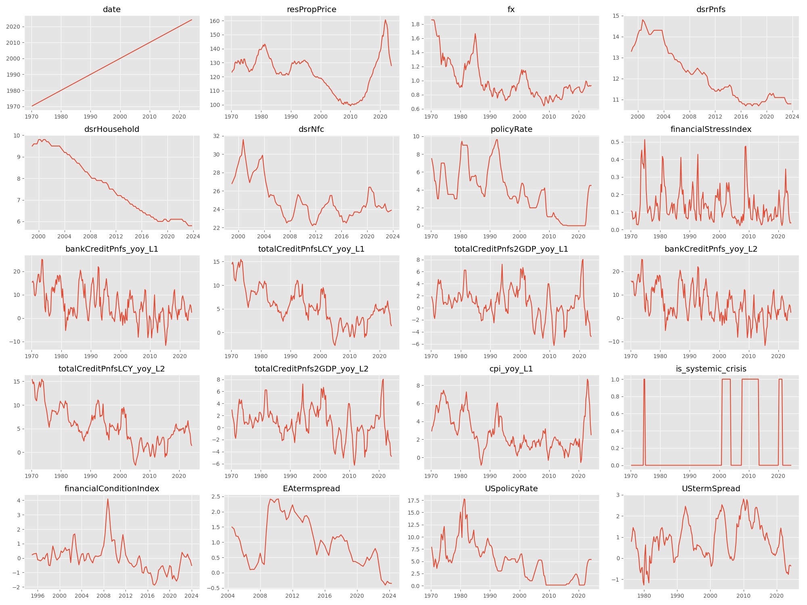
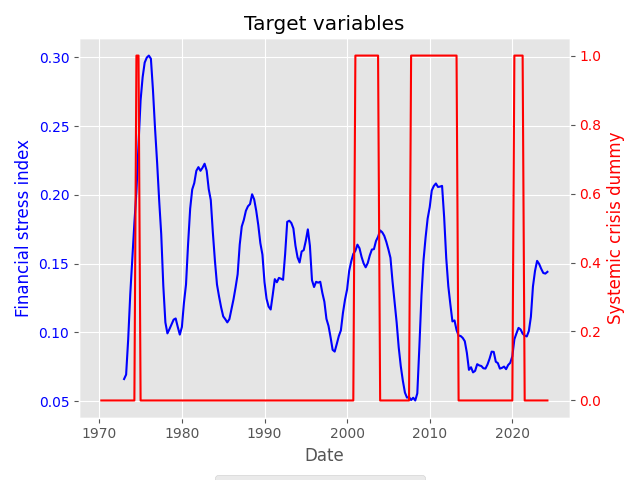
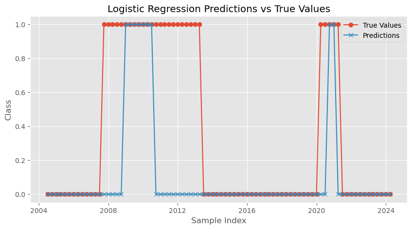

<!--
Add your stuff data and texts for the presentation here, I can generate a powerpoint/pdf from this. We can present that one in front of the group.

Add new slides by using three dashes (---)
add images using .
Markdown rules apply
-->

# Forcasting and nowcasting

### Towards predicting the next financial crisis

---

# Presentation overview

- Our plan
- Descriptive statistics
- Benchmark model
- Principal component analysis
- Results
- Next steps

---

# Plan

1. explore the dataset
2. define a target variable
3. feature selection and preprocessing
4. choose models for initial benchmarking
5. choose evaluation metrics
6. _Hyperparameter tuning_
7. _Integrate MLFLOW to store experiments results_
8. _evaluate the models peformance_

---

# Exploration

Descriptive statistics

---

# 1.1 Data preperation pipeline

```python
COUNTRY = 'DE'
FILE = './data/data_input_quarterly.csv'
TIME_INTERVALL = "quarterly"

df = read_data(FILE, COUNTRY)
df = get_processed_df(df, COUNTRY,TIME_INTERVALL, verbose=True)
df = subselect_data(df)

```

---

# 1.2 Data preperation pipeline

```python
df = give_sliding_window_volatility(df, 4, "fx")
df = calculate_growth_rates(df, yoy_variables)
df = get_lagged_variables(df, 2, lag2_variables)
df = add_missing_variables(df, country)
df = add_systemic_risk_dummy_with_df(df, df_dummies, country)
```


---

# Target value

- Systemic crisis _(dummy)_
- Systemic stress _continuous_
- Inflaction _?_



---

# Benchmarking

- OLS
- Random Forest
- Ridge
- XGBoost
- Logistic Regression

---

# Model interpretability and evaluation

- Shapley values
- Permutation importance
- RMSE
- F1-score
- ROC AUC
- R-squared (pseudo)

# PCA intuition

- Principal component analysis (PCA) reduces the number of dimensions in large datasets to principal components
- Retain original information.
- Tansforming potentially correlated variables into a smaller set of variables, called principal components.

(between us: just let Sklearn do the magic)

---

# PCA Pipeline

```python
from sklearn.decomposition import PCA

pca = PCA()
principalComponents = pca.fit_transform(X_SCALED)
PCA_components = pd.DataFrame(principalComponents)

explained_variance_ratio = pca.explained_variance_ratio_
_target_variance = 0.80
_current_variance = 0.0
_num_features = 0

while _current_variance < _target_variance:
    _current_variance += explained_variance_ratio[num_features]
    _num_features += 1

```

---

# PCA - preprocessed result


It seems to be too late, however, COVID-19 is exogenous and could not have been predicted. However, result is stable
