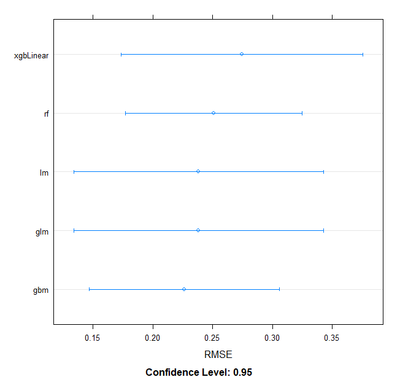
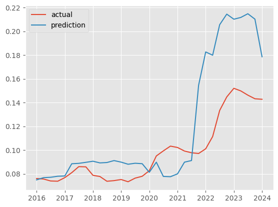
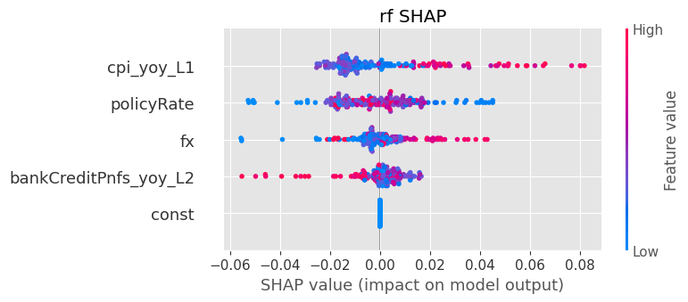
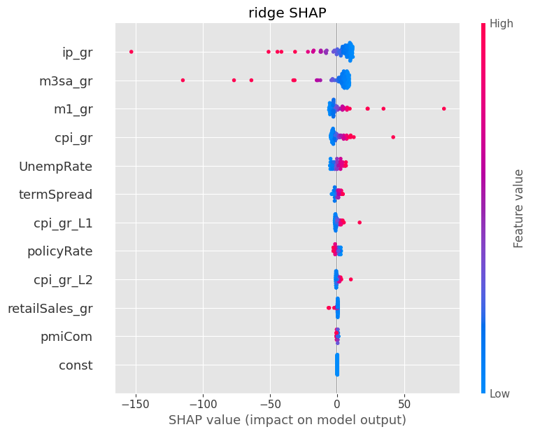
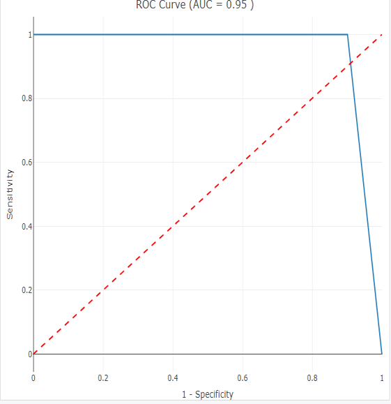
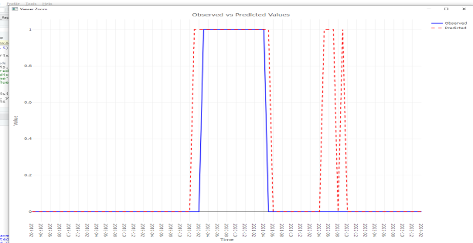

<!--
Add your stuff data and texts for the presentation here, I can generate a powerpoint/pdf from this. We can present that one in front of the group.

Add new slides by using three dashes (---)
add images using .
Markdown and html rules apply

Next time lets make the presentation in Jupyter again. I am not really a fan of this marp. Sorry guys.

-->

# Forcasting and nowcasting

### Towards predicting the next financial crisis

#### Mentor:

Alberto Americo

#### Participants:

Tiago, Vittorio, Georgios, Nikolaos, Robert, Francesco, Thomas

---

### "Data modeling is where art meets science. It requires the precision of a mathematician, the creativity of an artist, and the judgment of an experienced craftsman to transform raw data into valuable insights.“

## Gepetto di Firenze

---

# Presentation overview

- Our plan
- Descriptive statistics
- Benchmark model
- Principal component analysis
- Results
- Next steps

---

# Plan

1. explore the dataset
2. define a target variable
3. feature selection and preprocessing
4. choose models for initial benchmarking
5. choose evaluation metrics
6. _Hyperparameter tuning_
7. _Integrate MLFLOW to store experiments results_
8. _evaluate the models peformance_

---

# Exploration

| loansPnfs_yoy | resPropPrice | cpi_yoy  | fx       | totalCreditPnfs2GDP | totalCreditPnfsLCY | dsrPnfs  | dsrHousehold | dsrNfc   | policyRate | spotRate10year | EAtermSpread | spotRate2year | bankCreditPnfs | UStermSpread | financialStressIndex | financialStressDummy |
| ------------- | ------------ | -------- | -------- | ------------------- | ------------------ | -------- | ------------ | -------- | ---------- | -------------- | ------------ | ------------- | -------------- | ------------ | -------------------- | -------------------- |
| 192.000       | 3571.000     | 6397.000 | 5673.000 | 4014.000            | 4313.000           | 1300.000 | 1000.000     | 1000.000 | 3407.000   | 80.000         | 80.000       | 80.000        | 4186.000       | 193.000      | 4147.000             | 5275.000             |
| 4.473         | 87.228       | 9.984    | 8.107    | 124.944             | 2709.235           | 16.129   | 9.101        | 42.058   | 7.619      | 1.962          | 0.992        | 0.970         | 771.099        | 0.864        | 0.134                | 0.116                |
| 4.398         | 34.074       | 69.120   | 36.002   | 65.045              | 6816.442           | 6.198    | 4.398        | 9.768    | 52.751     | 1.614          | 0.768        | 1.628         | 1517.107       | 0.909        | 0.101                | 0.316                |
| -8.245        | 26.502       | -25.185  | 0.002    | 20.600              | 0.086              | 5.100    | 2.900        | 22.200   | -0.750     | -0.546         | -0.407       | -0.818        | 0.056          | -1.270       | 0.011                | 0.000                |
| 0.938         | 57.086       | 1.468    | 0.764    | 80.025              | 78.723             | 11.100   | 6.100        | 35.275   | 3.000      | 0.419          | 0.357        | -0.589        | 54.896         | 0.194        | 0.065                | 0.000                |
| 4.438         | 89.047       | 3.008    | 0.903    | 111.900             | 389.707            | 16.200   | 7.300        | 43.100   | 4.661      | 2.072          | 0.956        | 0.309         | 184.744        | 0.799        | 0.101                | 0.000                |
| 7.675         | 108.382      | 6.374    | 1.719    | 153.075             | 1930.761           | 20.400   | 11.200       | 49.300   | 7.815      | 3.493          | 1.665        | 2.478         | 687.356        | 1.493        | 0.172                | 0.000                |
| 14.662        | 218.092      | 1758.696 | 403.124  | 440.000             | 69362.120          | 32.200   | 23.600       | 70.000   | 2022.142   | 4.470          | 2.418        | 4.203         | 8946.007       | 2.801        | 0.853                | 1.000                |

---

# Data preperation pipeline

```python
COUNTRY = 'DE'
FILE = './data/data_input_quarterly.csv'
TIME_INTERVALL = "quarterly"

df = read_data(FILE, COUNTRY)
df = get_processed_df(df, COUNTRY,TIME_INTERVALL, verbose=True)
df = subselect_data(df)

```

---

# Data preperation pipeline

```python
df = give_sliding_window_volatility(df, 4, "fx")
df = calculate_growth_rates(df, yoy_variables)
df = get_lagged_variables(df, 2, lag2_variables)
df = add_missing_variables(df, country)
df = add_systemic_risk_dummy_with_df(df, df_dummies, country)
```

---


---

# Target value

- Systemic crisis _(dummy)_
- Systemic stress _continuous_
- Inflation _?_

---


---

# Benchmarking

- define train and test datasets
- define forecast horizon
- define set of regressors

### Models

- OLS
- Random Forest
- Ridge
- XGBoost
- Logistic Regression

---



Out of the 5 models observed, it was built an ensemble of them all having an optimisation function that applies different weights in order to get a better RMSE for the ensemble built


---

# Hyperparameters tuning

- GridSearchCV with TimeSeriesSplit

---

# Model interpretability and evaluation

- Shapley values
- Permutation importance
- RMSE
- F1-score
- ROC AUC
- R-squared (pseudo)

---
<<<<<<< HEAD


=======


>>>>>>> f50ac94 (adds dumb table)



In general, an AUC of 0.5 suggests no discrimination (i.e., ability to diagnose patients with and without the disease or condition based on the test), 0.7 to 0.8 is considered acceptable, 0.8 to 0.9 is considered excellent, and more than 0.9 is considered outstanding.

---

# PCA intuition

- Principal component analysis (PCA) reduces the number of dimensions in large datasets to principal components
- Retain original information.
- Tansforming potentially correlated variables into a smaller set of variables, called principal components.

(between us: just let Sklearn do the magic)

---

# PCA Pipeline

```python
from sklearn.decomposition import PCA

pca = PCA()
principalComponents = pca.fit_transform(X_SCALED)
PCA_components = pd.DataFrame(principalComponents)

explained_variance_ratio = pca.explained_variance_ratio_
_target_variance = 0.80
_current_variance = 0.0
_num_features = 0

while _current_variance < _target_variance:
    _current_variance += explained_variance_ratio[num_features]
    _num_features += 1

```

---

# PCA - preprocessed result


It seems to be too late, however, COVID-19 is exogenous and could not have been predicted. However, result is stable

---

# Result Robert alternative approach



Testing showed that the model was able to anticipate the crisis 3 months before (Covid period) and was also able to capture the geopolitical impact in comparison to the target variable


---

# Next steps

- Expand country coverage
- Try aggregate model
- Increase data frequency
- Try different forecast horizons
- Improve feature selection process
- Benchmark against commercial forecast (eg Bloomberg, Turnleaf)

- Public GIT repo to share knowledge amongst institutions

